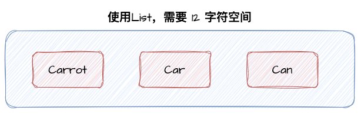
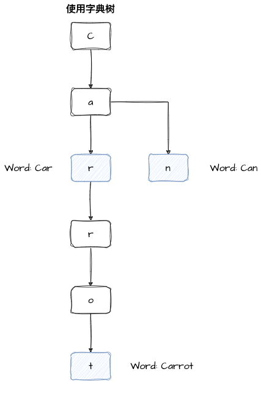
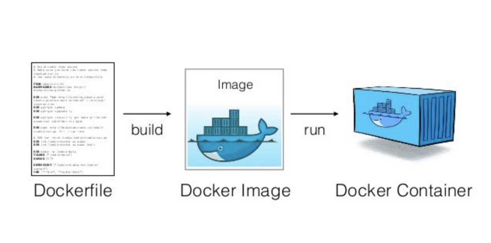
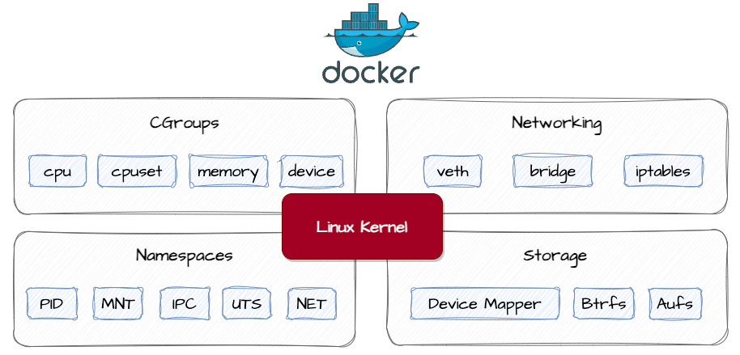

# code-sandbox

>代码沙箱的作用：**只负责接收代码和输入，返回编译运行的结果，不负责判题，可以作为独立的服务暴露出去**。

## 代码沙箱原生JDK实现

Java原生实现代码沙箱，尽可能不借助第三方库和依赖，用最干净原始的方式实现代码沙箱。

### 一、通过命令行执行Java代码

#### 1.1 Java程序执行的流程

接收代码 => 编译代码(javac) => 执行代码(java)

程序实例代码，注意没有package语句，文件位置位于项目的resource 目录下：

```java
public class SimpleCompute {
    public static void main(String[] args) {
        int a = Integer.parseInt(args[0]);
        int b = Integer.parseInt(args[1]);
        System.out.println("结果：" + (a + b));
    }
}
```

Java编译代码

```sh
javac {Java类代码路径}
```

> PS：此处可能出现乱码问题，可以在编译时指定编码：
>
> ```sh
> javac -encoding utf-8 {Java类代码路径}
> ```


Java执行代码，并携带参数：

```sh
java -cp {class文件所在路径} {class文件名} {参数}
```


示例：

```bash
➜  simple_computed_args git:(fea_jdk_sandbox) ✗ javac -encoding utf-8 ./SimpleCompute.java
➜  simple_computed_args git:(fea_jdk_sandbox) ✗ java -cp . SimpleCompute 3 7              
结果：10
```


#### 1.2 统一类名

在做 acm 模式的题目的时候。算法的类名都是统一的 Main，会对用户的输入的代码有一定的要求，便于后台进行统一的处理和判题。

作用：可以减少编译时类名不一致的风险，而且不用用户代码中提取类名，更方便。

Main.java：

```java
public class Main {
    public static void main(String[] args) {
        int a = Integer.parseInt(args[0]);
        int b = Integer.parseInt(args[1]);
        System.out.println("结果：" + (a + b));
    }
}
```

实际执行命令时，可以统一使用 Main 类名（在要编译的 Java 文件目录下）

```bash
➜  simple_computed_args git:(fea_jdk_sandbox) ✗ javac -encoding utf-8 ./Main.java         
➜  simple_computed_args git:(fea_jdk_sandbox) ✗ java -cp . Main 3 7                       
结果：10
```


### 二、核心流程实现

核心思路：使用程序代替人工，用程序来操作命令行完成编译执行代码

核心依赖：需要依赖Java的进程类Process


1. 把用户代码保存为文件
2. 编译代码，得到class文件
3. 执行代码，得到输出结果
4. 收集整理输出结果
5. 文件清理，释放空间
6. 错误处理，提升程序健壮性


#### 2.1 保存为代码文件

为了提高操作文件的效率，此处引入hutool核心类

```xml
<properties>
  <hutool.version>5.8.21</hutool.version>
</properties>

<dependencies>
  <dependency>
    <groupId>cn.hutool</groupId>
    <artifactId>hutool-core</artifactId>
    <version>${hutool.version}</version>
  </dependency>
</dependencies>
```

新建目录，将每个用户提交的代码都存放独立的目录下，通过UUID随机生成目录名，便于隔离和维护：

```java
public class JavaNativeCodeSandbox implements CodeSandbox {

  private static final String GLOBAL_CODE_DIR_NAME = "tmp_code";

  private static final String GLOBAL_CODE_FILE_NAME = "Main.java";

  @Override
  public ExecuteCodeResponse execute(ExecuteCodeRequest executeCodeRequest) {
    // 1、保存用户代码为文件
    String code = executeCodeRequest.getCode();
    // 获取用户工作文件路径
    String userDir = System.getProperty("user.dir");
    String globalCodePathName = userDir + File.separator + GLOBAL_CODE_DIR_NAME;

    // 判断全局文件路径是否存在
    if (!FileUtil.exist(globalCodePathName)) {
      // 不存在，则创建
      FileUtil.mkdir(globalCodePathName);
    }
    // 存在，则保存用户提交代码，用户代码隔离存放
    String userCodeParentPath = globalCodePathName + File.separator + UUID.randomUUID();
    // 实际存放文件的目录：Main.java
    String userCodePath = userCodeParentPath + File.separator + GLOBAL_CODE_FILE_NAME;
    File userCodeFile = FileUtil.writeBytes(code.getBytes(StandardCharsets.UTF_8), userCodePath);

    // ...
  }
}
```

#### 2.2 编译代码

使用Process类在终端执行命令：

```java
String compileCmd = String.format("javac -encoding utf-8 %s", userCodeFile.getAbsolutePath());
Process compileProcess = Runtime.getRuntime().exec(compileCmd);
```

执行 `process.waitFor` 等待程序执行完成，并通过返回的 `exitValue`判断程序是否正常返回，然后从 Process 的输入流 `inputStream`和错误流 `errorStream`获取控制台输出。

```java
// 2、编译代码，得到class文件
String compileCmd = String.format("javac -encoding utf-8 %s", userCodeFile.getAbsolutePath());

try {
  Process compileProcess = Runtime.getRuntime().exec(compileCmd);
  // 等待Process执行结束，得到退出状态码
  int exitValue = compileProcess.waitFor();
  // 正常编译，退出
  if (exitValue == 0) {
    log.info("Compile Java Code Success!");
    // 通过进程获取正常输出到控制台的信息
    BufferedReader logReader = new BufferedReader(new InputStreamReader(compileProcess.getInputStream()));
    StringBuilder compileLogStrBuilder = new StringBuilder();
    // 逐行读取
    String compileLogLine;
    while ((compileLogLine = logReader.readLine()) != null) {
      compileLogStrBuilder.append(compileLogLine);
    }
    log.info("Compile Code Logs: {}", compileLogStrBuilder);
  }
  // 出现异常
  else {
    log.error("Compile Java Code Failed!");
    // 通过进程获取正常输出到控制台的信息
    BufferedReader logReader = new BufferedReader(new InputStreamReader(compileProcess.getInputStream()));
    StringBuilder compileLogStrBuilder = new StringBuilder();
    // 逐行读取
    String compileLogLine;
    while ((compileLogLine = logReader.readLine()) != null) {
      compileLogStrBuilder.append(compileLogLine);
    }
    log.info("Compile Code Logs: {}", compileLogStrBuilder);
    // 分批获取进程的错误输出
    BufferedReader errorLogReader = new BufferedReader(new InputStreamReader(compileProcess.getErrorStream()));
    StringBuilder errorLogStrBuilder = new StringBuilder();
    // 逐行读取
    String errorLogLine;
    while ((errorLogLine = errorLogReader.readLine()) != null) {
      errorLogStrBuilder.append(errorLogLine);
    }
    log.error("Compile Code Error Logs: {}", errorLogStrBuilder);
  }
} catch (IOException | InterruptedException e) {
  throw new RuntimeException(e);
}
```

封装ExecuteMessage类，将上述代码抽取成工具类ProcessUtil

```java
import com.juzi.codesandbox.model.ExecuteMessage;
import lombok.extern.slf4j.Slf4j;
import org.apache.commons.lang3.StringUtils;
import org.springframework.util.StopWatch;

import java.io.BufferedReader;
import java.io.IOException;
import java.io.InputStream;
import java.io.InputStreamReader;
import java.util.ArrayList;
import java.util.List;

/**
 * 程序进程执行工具类
 *
 * @author codejuzi
 */
@Slf4j
public class ProcessUtil {

  public static ExecuteMessage getRunProcessMessage(String processType, Process runProcess) {
    ExecuteMessage executeMessage = new ExecuteMessage();
    StopWatch stopWatch = new StopWatch();

    try {
      stopWatch.start();
      // 等待Process执行结束，得到退出状态码
      int exitValue = runProcess.waitFor();
      executeMessage.setExitValue(exitValue);

      // 正常编译，退出
      if (exitValue == 0) {
        log.info("{} Success!", processType);
      }
      // 出现异常
      else {
        log.error("{} Failed! ExitValue: {}", processType, exitValue);
        executeMessage.setErrorMessage(getMessage(runProcess.getErrorStream()));
      }
      executeMessage.setMessage(getMessage(runProcess.getInputStream()));
      stopWatch.stop();
      executeMessage.setTime(stopWatch.getLastTaskTimeMillis());
    } catch (IOException | InterruptedException e) {
      throw new RuntimeException(e);
    }
    return executeMessage;
  }

  private static String getMessage(InputStream is) throws IOException {
    // 通过进程获取正常输出到控制台的信息
    BufferedReader logReader = new BufferedReader(new InputStreamReader(is));
    List<String> logLineList = new ArrayList<>();
    // 逐行读取
    String logLine;
    while ((logLine = logReader.readLine()) != null) {
      logLineList.add(logLine);
    }
    return StringUtils.join(logLineList, "\n");
  }
}
```


#### 2.3 执行程序

使用Process类执行Java命令，为了解决编译或者运行的时候出现乱码问题，在指令中加入：

```bash
-Dfile.encoding=UTF-8
```

此命令适用于执行从输入参数（args）中获取值的代码。

```java
// 3、执行代码
String runCmdPattern = "java -Dfile.encoding=UTF-8 -cp %s Main %s";
List<String> inputList = executeCodeRequest.getInputList();
for (String inputArgs : inputList) {
  String runCmd = String.format(runCmdPattern, userCodeParentPath, inputArgs);

  try {
    Process runProcess = Runtime.getRuntime().exec(runCmd);
    ExecuteMessage executeMessage = ProcessUtil.getRunProcessMessage("Run Code", runProcess);
    log.info("execute message: {}", executeMessage);
  } catch (IOException e) {
    throw new RuntimeException(e);
  }
}
```

很多 OJ 都是 ACM  赛制，需要和用户交互，让用户不断输入内容并获取输出。

部分 acm 赛制需要进行`Scanner`控制台输入。对此类程序，需要使用`OutPutStream`向程序终端发送参数，并及时获取结果，最后需要记得关闭字节流释放资源。

新增交互式方法：

```java
public static ExecuteMessage getInteractProcessMessage(Process runProcess, String args) {
  ExecuteMessage executeMessage = new ExecuteMessage();

  try (OutputStream outputStream = runProcess.getOutputStream();
       OutputStreamWriter outputStreamWriter = new OutputStreamWriter(outputStream)) {
    // 从控制台输入参数
    String[] arguments = args.split(" ");
    String join = StringUtils.join(arguments, "\n") + "\n";
    outputStreamWriter.write(join);
    // 回车，发送参数
    outputStreamWriter.flush();

    executeMessage.setMessage(getMessage(runProcess.getInputStream()));

    // 释放资源
    runProcess.destroy();
  } catch (Exception e) {
    e.printStackTrace();
  }
  return executeMessage;
}
```


测试程序：

```java
import java.util.*;

public class Main {
    public static void main(String[] args) {
        Scanner cin = new Scanner(System.in);
        int a = cin.nextInt(), b = cin.nextInt();
        System.out.println("结果：" + (a + b));
    }
}
```

执行程序：

```java
// 3、执行代码
String runCmdPattern = "java -Dfile.encoding=UTF-8 -cp %s Main %s";
List<String> inputList = executeCodeRequest.getInputList();
for (String inputArgs : inputList) {
  String runCmd = String.format(runCmdPattern, userCodeParentPath, inputArgs);

  try {
    Process runProcess = Runtime.getRuntime().exec(runCmd);
    ExecuteMessage executeMessage = ProcessUtil.getInteractProcessMessage(runProcess, inputArgs); // 交互式
    // ExecuteMessage executeMessage = ProcessUtil.getRunProcessMessage("Run Code", runProcess);
    log.info("execute message: {}", executeMessage);
  } catch (IOException e) {
    throw new RuntimeException(e);
  }
}
```


#### 2.4 整理输出

1. 通过循环遍历执行结果，从中获取输出列表
2. 获取程序执行时间（使用Spring的StopWatch计时）

可以使用最大值来统计时间，便于后续判题服务计算程序是否超时

```java
// 4、整理输出结果
ExecuteCodeResponse executeCodeResponse = new ExecuteCodeResponse();
long maxExecTime = 0L;
List<String> outputList = new ArrayList<>();
for (ExecuteMessage executeMessage : executeMessageList) {
  String errorMessage = executeMessage.getErrorMessage();
  if (StringUtils.isNotBlank(errorMessage)) {
    // 执行中出错
    executeCodeResponse.setMessage(errorMessage);
    executeCodeResponse.setStatus(FAILED.getValue());
    break;
  }
  outputList.add(executeMessage.getMessage());

  Long execTime = Optional.ofNullable(executeMessage.getTime()).orElse(0L);
  maxExecTime = Math.max(maxExecTime, execTime);
}
// 正常执行
if (outputList.size() == executeMessageList.size()) {
  executeCodeResponse.setStatus(RUNNING.getValue());
}
executeCodeResponse.setOutputList(outputList);

JudgeInfo judgeInfo = new JudgeInfo();
// todo Java原生获取内存占用
judgeInfo.setMemory(0L);
judgeInfo.setTime(maxExecTime);
executeCodeResponse.setJudgeInfo(judgeInfo);

return executeCodeResponse;
```

获取内存信息：实现比较复杂，因为无法从 Process 对象中获取到子进程号，也不推荐在 Java 原生实现代码沙箱的过程中获取。

> 扩展：可以每个测试用例都有一个独立的内存、时间占用的统计


#### 2.5 文件清理

防止服务器空间不足，删除代码目录：

```java
// 5、清理文件
if (userCodeFile.getParentFile() != null) {
  boolean delFileRes = FileUtil.del(userCodeParentPath);
  log.info("Delete File Result: {}", delFileRes);
}
```


#### 2.6 统一错误处理

封装一个错误处理方法，当程序抛出异常的时候，直接返回错误响应。

```java
private ExecuteCodeResponse handleError(Throwable e) {
  ExecuteCodeResponse response = new ExecuteCodeResponse();
  response.setOutputList(Collections.emptyList());
  response.setMessage(e.getMessage());
  response.setStatus(FAILED.getValue());
  response.setJudgeInfo(new JudgeInfo());
  return response;
}
```


### 三、Java程序异常情况

> 针对于本项目：用户提交恶意代码等


#### 3.1 执行超时（时间上）

占用时间资源，导致程序卡死，不释放资源。

例如：

```java
public class Main {
    public static void main(String[] args) throws InterruptedException {
        long ONE_HOUR = 60 * 60 * 1000L;
        Thread.sleep(ONE_HOUR);
        System.out.println("睡醒了");
    }
}
```


#### 3.2 占用内存（空间上）

占用内存资源，导致空间浪费。

例如：

```java
public class MemoryError {
    public static void main(String[] args) {
        List<byte[]> bytes = new ArrayList<>();
        while (true) {
            bytes.add(new byte[100000]);
        }
    }
}
```

实际运行上述程序时，我们会发现，内存占用到达一定空间后，程序就自动报错：`java.lang.OutOfMemoryError: Java heap space`，而不是无限增加内存占用，直到系统死机。这是 JVM 的一个保护机制。

> 可以使用 JVisualVM 或 JConsole 工具，连接到 JVM 虚拟机上来可视化查看运行状态。


#### 3.3 读文件，信息泄露

如：可以直接通过相对路径获取项目配置文件，获取到项目敏感配置信息

```java
public class Main {
    public static void main(String[] args) throws InterruptedException, IOException {
      String userDir = System.getProperty("user.dir");
      String filePath = userDir + File.separator + "src/main/resources/application.yml";
      List<String> allLines = Files.readAllLines(Paths.get(filePath));
      System.out.println(String.join("\n", allLines));
  }
}
```


#### 3.4 写文件，植入病毒

可以直接向服务器上写入文件。

比如一个木马程序：`java -version 2>&1`（示例命令）

1. `java -version` 用于显示 Java 版本信息。这会将版本信息输出到标准错误流（stderr）而不是标准输出流（stdout）。
2. `2>&1` 将标准错误流重定向到标准输出流。这样，Java 版本信息就会被发送到标准输出流。

```java
public class Main {
    public static void main(String[] args) throws InterruptedException, IOException {
        String userDir = System.getProperty("user.dir");
        String filePath = userDir + File.separator + "src/main/resources/木马程序.bat";
        String errorProgram = " java -version 2>&1";
        Files.write(Paths.get(filePath), Arrays.asList(errorProgram));
        System.out.println("执行异常程序成功");
    }
}
```


#### 3.5 运行其他程序

直接通过Process执行危险程序或者电脑上的其他程序

```java
public static void main(String[] args) throws InterruptedException, IOException {
    String userDir = System.getProperty("user.dir");
    String filePath = userDir + File.separator + "src/main/resources/木马程序.bat";
    Process process = Runtime.getRuntime().exec(filePath);
    process.waitFor();
    // 分批获取进程的正常输出
    BufferedReader bufferedReader = new BufferedReader(new InputStreamReader(process.getInputStream()));
    // 逐行读取
    String compileOutputLine;
    while ((compileOutputLine = bufferedReader.readLine()) != null) {
        System.out.println(compileOutputLine);
    }
    System.out.println("执行异常程序成功");
}
```


#### 3.6 执行高危操作

甚至都不用写木马文件，直接执行系统自带的危险命令！

- 比如删除服务器的所有文件（太残暴，不要轻易学习）
- 比如执行 dir（windows）、ls（linux） 获取你系统上的所有文件信息


### 四、Java程序安全管理

针对上面的异常情况，分别有如下方案，可以提高程序安全性：

#### 4.1 超时控制

创建一个守护线程，超时后自动终止Process线程

```java
// 超时控制
new Thread(() -> {
    try {
        Thread.sleep(TIME_OUT);
        System.out.println("程序运行超时，已经中断");
        runProcess.destroy();
    } catch (Exception e) {
        throw new RuntimeException(e);
    }
}).start();
```


#### 4.2 限制给用户程序分配的资源

我们不能让每个 java 进程的执行占用的 JVM 最大堆内存空间都和系统默认的一致，实际上应该更小（执行用户的题目代码也不需要这么多），比如说 256MB。在启动 Java 程序时，可以指定 JVM 的参数：-Xmx256m（最大堆空间大小）

> 注意！-Xmx 参数、JVM 的堆内存限制，不等同于系统实际占用的最大资源，可能会超出。 
>
> 如果需要更严格的内存限制，要在系统层面去限制，而不是 JVM 层面的限制。
>
> 如果是 Linux 系统，可以使用 cgroup 来实现对某个进程的 CPU、内存等资源的分配。

##### 4.2.1 cgroup简介

`cgroup`是 Linux 内核提供的一种机制，可以用来限制进程组（包括子进程）的资源使用，例如内存、CPU、磁盘 I/O 等。通过将 Java 进程放置在特定的 `cgroup`中，可以实现限制其使用的内存和 CPU 数。

##### 4.2.2 常用的JVM启动参数

1. 内存相关参数：

- -  `-Xms`: 设置 JVM 的初始堆内存大小
        - `-Xmx`: 设置 JVM 的最大堆内存大小
        - `-Xss`: 设置线程的栈大小
        - `-XX:MaxMetaspaceSize`: 设置 Metaspace（元空间）的最大大小
        - `-XX:MaxDirectMemorySize`: 设置直接内存（Direct Memory）的最大大小。

2. 垃圾回收相关参数

- -  `-XX:+UseSerialGC`: 使用串行垃圾回收器
        -  `-XX:+UseParallelGC`: 使用并行垃圾回收器
        -  `-XX:+UseConcMarkSweepGC`: 使用 CMS 垃圾回收器
        -  `-XX:+UseG1GC`: 使用 G1 垃圾回收器

3. 线程相关参数

- -  `-XX:ParallelGCThreads`: 设置并行垃圾回收的线程数
        - `-XX:ConcGCThreads`: 设置并发垃圾回收的线程数
        - `-XX:ThreadStackSize`: 设置线程的栈大小

4. JIT 编译器相关参数

- - `-XX:TieredStopAtLevel`: 设置 JIT 编译器停止编译的层次

5. 其他资源限制参数

- - `-XX:MaxRAM`: 设置 JVM 使用的最大内存

#### 4.3 限制代码 - 黑白名单

##### 4.3.1 实现

先定义一个黑白名单，比如哪些操作是禁止的，可以是一个列表：

```java
// 黑名单
public static final List<String> blackList = Arrays.asList("Files", "exec");
```

还可以使用字典树代替列表存储单词，用 **更少的空间** 存储更多的敏感词汇，并且实现**更高效**的敏感词查找。


##### 4.3.2 字典树

字典树（Trie树，也称为前缀树）是一种树形数据结构，用于高效地存储和搜索字符串集合。

字典树的**基本原理**：

1. 字典树单根节点的树形结构，根节点不包含任何字符信息
2. 每个节点都包含一个存储的字符和子节点的列表或映射
3. 从根节点到任意一个节点的路径上的字符连接起来就组成该节点对应的字符串
4. 插入操作：将一个字符串的每个字符依次插入到树中的节点上
5. 查询操作：从树的根节点开始，按照要查询的字符顺序，逐级匹配字符并向下遍历树
6. 终止节点：可以用一个标志来标记某个节点是否为一个字符串的终止节点，比如一个布尔变量

字典树的**主要优点**： 

1. 高效地存储和查找字符串集合，特别适合处理大量字符串的前缀匹配和前缀搜索
2. 提供了最长公共前缀的查找能力
3. 可以快速地查找指定前缀的所有字符串

总结来说，字典树是一种高效的数据结构，用于存储和搜索字符串集合。通过利用字符串的共同前缀，字典树可以大大提高字符串存储和检索的效率。


示例：

现在包含有Carrot、Car、Can三个违禁词：

若采用List存储，需要12字符的存储空间



若采用字典树，能够节约空间



此处引入Hutool工具库中的字典树工具类：WordTree

1）初始化字典数，插入禁用词

```java
private static final WordTree WORD_TREE;

static {
    // 初始化字典树
    WORD_TREE = new WordTree();
    WORD_TREE.addWords(blackList);
}
```

2）检测用户代码是否包含敏感词

```java
// 校验代码是否包含有黑名单中命令
FoundWord foundWord = WORD_TREE.matchWord(code);
if (foundWord != null) {
    System.out.println("此文件包含敏感词：" + foundWord.getFoundWord());
    return null;
}
```


**缺点**

1. 无法遍历所有的黑名单
2. 不同的编程语言，你对应的领域、关键词都不一样，限制人工成本很大


#### 4.4 限制用户的操作权限（文件、网络、执行等）

目标：限制用户对文件、内存、CPU、网络等资源的操作和访问

##### 4.4.1 Java安全管理器使用

Java 安全管理器（Security Manager）是 Java 提供的保护 JVM、Java 安全的机制，可以实现更严格的资源和操作限制。

编写安全管理器，只需要继承 SecurityManager。

实际情况下，不应该在主类（开发者自己写的程序）中做限制，只需要限制子程序的权限即可。启动子进程执行命令时，设置安全管理器，而不是在外层设置（会限制住测试用例的读写和子命令的执行）。

具体操作如下：

1. 根据需要开发自定义的安全管理器（比如 `UserCodeSecurityManager`）
2. 复制 `UserCodeSecurityManager` 类到 `resources/security`目录下，**移除类的包名**
3. 手动输入命令编译 `UserCodeSecurityManager`类，得到 `class`文件
4. 在运行 java 程序时，指定安全管理器 class 文件的路径、安全管理器的名称。

```java
private static final String SECURITY_MANAGER_CLASS_PATH = "/Users/codejuzi/Documents/CodeWorkSpace/Projects/JuOj/code-sandbox/src/main/resources/security";

private static final String SECURITY_CLASS_NAME = "UserCodeSecurityManager";

// 3、执行代码
// 此处mac下是使用 : 分割不同类，windows下是使用 ; 分割不同类名
String runCmdPattern = "java -Dfile.encoding=UTF-8 -cp %s:%s -Djava.security.manager=%s Main %s";
List<String> inputList = executeCodeRequest.getInputList();
List<ExecuteMessage> executeMessageList = new ArrayList<>();
for (String inputArgs : inputList) {
  String runCmd = String.format(runCmdPattern, userCodeParentPath,
                                SECURITY_MANAGER_CLASS_PATH, SECURITY_CLASS_NAME, inputArgs);
  // ...
}
```


##### 4.4.2 安全管理器优点

1. 权限控制灵活
2. 实现简单

##### 4.4.3 安全管理器缺点

1. 如果要做比较严格的权限限制，需要自己去判断哪些文件、包名需要允许读写。粒度太细了，难以精细化控制。
2. 安全管理器本身也是 Java 代码，也有可能存在漏洞。本质上还是程序层面的限制，没深入系统的层面。


#### 4.5 运行环境隔离(Docker代码沙箱实现)

原理：操作系统层面上，把用户程序封装到沙箱里，和宿主机（PC主机 / 服务器）隔离开，使得用户的程序无法影响宿主机。

实现方式：Docker 容器技术（底层是用 cgroup、namespace 等方式实现的），也可以直接使用 cgroup 实现。


## 代码沙箱Docker实现

### 一、Docker容器技术

为什么要使用Docker容器技术？

**为了进一步提升系统的安全性，把不同的程序和宿主机进行隔离，使得某个程序（应用）的执行不会影响到系统本身。**

Docker技术可以实现程序和宿主机的隔离。

#### 1.1 什么是容器？

理解为对一系列应用程序、服务和环境的封装，从而把程序运行在一个隔离的、密闭的、隐私的空间内，对外整体提供服务。

> 可以把一个容器理解为一个新的电脑（定制化的操作系统）


#### 1.2 Docker基本概念

**镜像image**：用来创建容器的安装包，可以理解为给电脑安装操作系统的系统镜像

**容器Container**：通过镜像来创建一套运行环境，一个容器里可以运行多个程序，可以理解为一个电脑实例

**Dockerfile**：制作镜像的文件，可以理解为制作镜像的一个清单

**镜像仓库**：存放镜像的仓库，用户可以从仓库下载现成的镜像，也可以把做好的容器放到仓库内（推荐使用Docker官方的镜像仓库DockerHub：https://hub.docker.com/)




#### 1.3 Docker实现核心



> Docker可以实现上述资源的隔离

1）Docker运行在Linux内核上

2）CGroups：实现了容器的资源隔离，底层是Linux cgoup命令，能够控制进程使用的资源

3）Network：实现容器的网络隔离，Docker容器内部的网络互不影响

4）Namespaces：可以把进程隔离在不同的命名空间下，每个容器都可以有自己的命名空间，不同命名空间下的进程互不影响

5）Storage：容器内的文件是相互隔离的，也可以去使用宿主机的文件

Docker Compose：是一种同时启动多个容器的集群操作工具（容器管理工具），一般情况下，开发者仅做了解，实际使用Docker Compose时Copy配置文件即可。


#### 1.4 安装Docker

参照Docker官网：https://docs.docker.com/desktop/install/linux-install/


#### 1.5 命令行操作Docker

1）查看命令用法：

```sh
docker --help
# 查看具体子命令的用法，比如docker run 命令
docker run --help
```


2）从远程仓库拉取现成的镜像

```sh
docker pull [OPTIONS] NAME[:TAG|@DIGEST]
```


3）根据镜像创建容器实例

启动实例，得到容器实例containerId

```sh
docker create [OPTIONS] IMAGE [COMMAND] [ARG...]

sudo docker create hello-world
```

4）查看所有容器状态（包括未启动的）

```sh
sudo docker ps -a
```

5）启动容器

```sh
docker start [OPTIONS] CONTAINER [CONTAINER...]
```

6）查看容器日志

```sh
docker logs [OPTIONS] CONTAINER
```

7）删除容器

```sh
docker rm [OPTIONS] CONTAINER [CONTAINER...]
```

8）删除镜像：

删除镜像之前要删除掉使用到此镜像的容器，或者停止运行使用此镜像的容器

```sh
docker rmi [OPTIONS] IMAGE [IMAGE...]
```

9） 其他：构建镜像（build）、推送镜像（push）、运行容器（run）、执行容器命令（exec）等 


### 二、Java操作Docker

#### 2.1 前置准备

使用 Docker-Java：https://github.com/docker-java/docker-java

官方入门：https://github.com/docker-java/docker-java/blob/main/docs/getting_started.md

引入依赖：

```xml
<!-- https://mvnrepository.com/artifact/com.github.docker-java/docker-java -->
<dependency>
    <groupId>com.github.docker-java</groupId>
    <artifactId>docker-java</artifactId>
    <version>3.3.0</version>
</dependency>
<!-- https://mvnrepository.com/artifact/com.github.docker-java/docker-java-transport-httpclient5 -->
<dependency>
    <groupId>com.github.docker-java</groupId>
    <artifactId>docker-java-transport-httpclient5</artifactId>
    <version>3.3.0</version>
</dependency>
```

`DockerClientConfig`：用于定义初始化 DockerClient 的配置（类比 MySQL 的连接、线程数配置)

`DockerHttpClient`（不推荐使用）：用于向 Docker 守护进程（操作 Docker 的接口）发送请求的客户端，低层封装，还要自己构建请求参数（简单地理解成 JDBC）

`DockerClient`（推荐）：才是真正和 Docker 守护进程交互的、最方便的 SDK，高层封装，对 `DockerHttpClient`再进行了一层封装（理解成 MyBatis），提供了现成的增删改查

#### 2.2 常用操作

1）创建DockerClient

> 参考https://juejin.cn/post/7172149049284362247#heading-15

```java
DockerClientConfig config = DefaultDockerClientConfig.createDefaultConfigBuilder()
                .withDockerHost(DockerProperties.DOCKER_HOST)
                .withApiVersion(DockerProperties.API_VERSION)
                .build();
DockerClient dockerClient = DockerClientBuilder.getInstance(config).build();
```


2）拉取镜像

```java
// 1、拉取镜像
String image = "nginx:stable";
PullImageCmd pullImageCmd = dockerClient.pullImageCmd(image);
try {
  PullImageResultCallback pullImageResultCallback = new PullImageResultCallback() {
    @Override
    public void onNext(PullResponseItem item) {
      System.out.println("Pull Image => " + item.getStatus());
      super.onNext(item);
    }
  };
  pullImageCmd.exec(pullImageResultCallback).awaitCompletion();
  System.out.println("拉取完成");
} catch (InterruptedException e) {
  throw new RuntimeException(e);
}
```

3）创建容器

```java
// 2、创建容器
CreateContainerCmd containerCmd = dockerClient.createContainerCmd(image);
CreateContainerResponse response = containerCmd.withCmd("echo", "Hello Nginx").exec();
String containerId = response.getId();
System.out.println("Container Id: " + containerId);
```


4）查看容器状态

```java
// 3、查看容器状态
ListContainersCmd listContainersCmd = dockerClient.listContainersCmd();
List<Container> containerList = listContainersCmd.withShowAll(true).exec();
for (Container container : containerList) {
  System.out.println(container);
}
```

5）启动容器

```java
// 4、启动容器
dockerClient.startContainerCmd(containerId).exec();
```

6）查看容器日志

```java
// 5、查看启动容器日志
LogContainerResultCallback resultCallback = new LogContainerResultCallback() {
  @Override
  public void onNext(Frame item) {
    System.out.println(containerId + " 此容器日志:" + new String(item.getPayload()));
    super.onNext(item);
  }
};
dockerClient.logContainerCmd(containerId)
  .withStdErr(true) // 错误输出
  .withStdOut(true) // 标准输出
  .exec(resultCallback)
  .awaitCompletion(); // 异步操作
```

7）删除容器

```java
// 6、删除容器
dockerClient.removeContainerCmd(containerId)
  .withForce(true) // 强制删除
  .exec();

// 删除所有容器
for (Container container : containerList) {
  if (container.getId() != null) {
    dockerClient.removeContainerCmd(container.getId())
      .withForce(true) // 强制删除
      .exec();
  }
}
```

8）删除镜像

```java
// 7、删除镜像
dockerClient.removeImageCmd(image).exec();
```


### 三、Docker实现代码沙箱

实现思路：Docker负责运行Java程序，并且得到结果

流程几乎和Java原生代码沙箱实现一致：

1. 把用户的代码保存为文件
2. 编译代码，得到 class 文件
3. 把编译好的文件上传到容器环境内
4. 在容器中执行代码，得到输出结果
5. 收集整理输出结果
6. 文件清理，释放空间
7. 错误处理，提升程序健壮性

> 模板方法模式：定义同一套实现流程，让不同的子类去负责不同流程中的具体实现，执行步骤一样，每个步骤的实现方式不一样。


#### 3.1 创建容器，上传编译文件

自定义容器的两种方式：

1. 在已有镜像的基础上再扩充，比如拉取现成的Java镜像，再把编译后的文件复制到容器里。（适合新项目，跑通流程）
2. 完全自定义容器：适合比较成熟的项目，比如封装多个语言的环境和实现

```java
String image = "openjdk:8-alpine";
if (FIRST_INIT) { // true
    PullImageCmd pullImageCmd = dockerClient.pullImageCmd(image);
    try {
      PullImageResultCallback pullImageResultCallback = new PullImageResultCallback() {
        @Override
        public void onNext(PullResponseItem item) {
          log.info("Pull Image => " + item.getStatus());
          super.onNext(item);
        }
      };
      pullImageCmd.exec(pullImageResultCallback).awaitCompletion();
      log.info("Pull Image Succeed!");
      FIRST_INIT = false;
    } catch (InterruptedException e) {
      log.error("Pull Image Failed!");
      throw new RuntimeException(e);
    }
}
```

思考：每个测试用例都单独创建一个容器，每个容器只执行一次 java 命令？

这是很浪费性能，所以要创建一**可交互**的容器，能接受多次输入并且输出。

创建容器时，可以指定文件路径（Volumn） 映射，作用是把本地的文件同步到容器中，可以让容器访问。

```java
// 3.2 创建容器
CreateContainerCmd containerCmd = dockerClient.createContainerCmd(image);
// 创建容器配置
HostConfig hostConfig = new HostConfig();
// 限制内存
hostConfig.withMemory(100 * 1000 * 1000L);
// 设置CPU核数
hostConfig.withCpuCount(1L);
// 设置容器挂载目录
hostConfig.setBinds(new Bind(userCodeParentPath, new Volume("/app/code")));
CreateContainerResponse response = containerCmd
  .withHostConfig(hostConfig)
  // 开启输入输出
  .withAttachStderr(true)
  .withAttachStdin(true)
  .withAttachStdout(true)
  // 开启交互终端
  .withTty(true)
  .exec();

String containerId = response.getId();
log.info("container id: {}", containerId);
```


#### 3.2 启动容器，执行代码

##### 3.2.1 执行代码


Docker执行容器命令（操作已启动的容器）：

```sh
docker exec [OPTIONS] CONTAINER COMMAND [ARG...]
```

> 注意：要把命令按照空格拆分，作为一个数组传递，否则可能会被识别为一个字符串，而不是多个参数。

创建命令：

```java
String[] inputArgsArr = inputArgs.split(" ");
String[] cmdArr = ArrayUtil.append(new String[]{"java", "-cp", "/app/code", "Main"}, inputArgsArr);
ExecCreateCmdResponse execCreateCmdResponse = dockerClient.execCreateCmd(containerId)
  .withCmd(cmdArr)
  .withAttachStderr(true)
  .withAttachStdin(true)
  .withAttachStdout(true)
  .exec();
```

执行命令，通过回调接口来获取程序的输出结果，并且通过 StreamType 来区分标准输出和错误输出。

```java
List<String> inputList = executeCodeRequest.getInputList();
for (String inputArgs : inputList) {
  String[] inputArgsArr = inputArgs.split(" ");
  String[] cmdArr = ArrayUtil.append(new String[]{"java", "-cp", "/app/code", "Main"}, inputArgsArr);
  ExecCreateCmdResponse execCreateCmdResponse = dockerClient.execCreateCmd(containerId)
    .withCmd(cmdArr)
    .withAttachStderr(true)
    .withAttachStdin(true)
    .withAttachStdout(true)
    .exec();
  String execId = execCreateCmdResponse.getId();
  log.info("创建执行命令ID：{}", execId);

  final boolean[] isTimeOut = {true};
  if (execId == null) {
    throw new RuntimeException("执行命令不存在");
  }
  ExecStartResultCallback execStartResultCallback = new ExecStartResultCallback() {
    @Override
    public void onNext(Frame frame) {
      // 获取程序执行信息
      StreamType streamType = frame.getStreamType();
      if (StreamType.STDERR.equals(streamType)) {
        errorDockerMessage[0] = new String(frame.getPayload());
        log.error("错误输出结果：{}", errorDockerMessage[0]);
      } else {
        dockerMessage[0] = new String(frame.getPayload());
        log.info("输出结果：{}", dockerMessage[0]);
      }
      super.onNext(frame);
    }

    @Override
    public void onComplete() {
      // 设置不超时
      isTimeOut[0] = false;
      super.onComplete();
    }
  };
  try {
    // 执行启动命令
    dockerClient.execStartCmd(execId).exec(execStartResultCallback).awaitCompletion();
  } catch (InterruptedException e) {
    throw new RuntimeException(e);
  }
```

> 尽量复用之前的 ExecuteMessage 对象，在异步接口中填充正常和异常信息，这样之后流程的代码都可以复用。

##### 3.2.2 获取程序执行时间

使用StopWatch统计前后执行时间

```java
// 执行启动命令
stopWatch.start();
dockerClient.execStartCmd(execId)
  .exec(execStartResultCallback)
  .awaitCompletion(TIME_OUT, TimeUnit.MILLISECONDS);
stopWatch.stop();
// 获取总时间
time = stopWatch.getLastTaskTimeMillis();
```


##### 3.2.3 获取程序占用内存

程序占用的内存每个时刻都在变化，所以不可能获取到所有时间点的内存。

定义一个周期，定期地获取程序的内存。

Docker-Java 提供了内存定期统计的操作:

```java
StatsCmd statsCmd = dockerClient.statsCmd(containerId);
ResultCallback<Statistics> statisticsResultCallback = statsCmd.exec(new ResultCallback<Statistics>() {
  @Override
  public void onStart(Closeable closeable) {
  }

  @Override
  public void onNext(Statistics statistics) {
    Long usageMemory = Optional.ofNullable(statistics.getMemoryStats().getUsage()).orElse(0L);
    maxMemory[0] = Math.max(usageMemory, maxMemory[0]);
    log.info("内存占用：{}", usageMemory);
  }

  @Override
  public void onError(Throwable throwable) {
  }

  @Override
  public void onComplete() {
  }

  @Override
  public void close() {

  }
});
statsCmd.exec(statisticsResultCallback);
```

注意，程序执行完后要关闭统计命令，统计完时间后要关闭：

```java
statsCmd.close();
```

### 四、Docker容器安全性

#### 4.1 超时控制

执行容器时，可以增加超时参数控制值：

但是，这种方式无论超时与否，都会往下执行，无法判断是否超时。

解决方案：可以定义一个标志，如果程序执行完成，把超时标志设置为 false。

```java
@Override
public void onComplete() {
  // 设置不超时
  isTimeOut[0] = false;
  super.onComplete();
}


// 执行启动命令
stopWatch.start();
dockerClient.execStartCmd(execId)
  .exec(execStartResultCallback)
  .awaitCompletion(TIME_OUT, TimeUnit.MILLISECONDS);
stopWatch.stop();
```


#### 4.2 内存资源

通过`HostConfig`的`withMemory`等方法，设置容器的最大内存和资源限制：

```java
// 3.2 创建容器
CreateContainerCmd containerCmd = dockerClient.createContainerCmd(image);
// 创建容器配置
HostConfig hostConfig = new HostConfig();
// 限制内存
hostConfig.withMemory(100 * 1000 * 1000L);
hostConfig.withMemorySwap(0L);
// 设置CPU核数
hostConfig.withCpuCount(1L);
// 设置容器挂载目录
hostConfig.setBinds(new Bind(userCodeParentPath, new Volume("/app/code")));
CreateContainerResponse response = containerCmd
  .withHostConfig(hostConfig)
  // 开启输入输出
  .withAttachStderr(true)
  .withAttachStdin(true)
  .withAttachStdout(true)
  // 开启交互终端
  .withTty(true)
  .exec();
```

#### 4.3 网络资源

创建容器时，设置网络配置为关闭：

```java
CreateContainerResponse response = containerCmd
                .withHostConfig(hostConfig)
                // 禁用网络
                .withNetworkDisabled(true)
  // ...
```

#### 4.4 权限管理

Docker 容器已经做了系统层面的隔离，比较安全，但不能保证绝对安全。

1. 结合 Java 安全管理器和其他策略去使用 

2. 限制用户不能向 root 根目录写文件

    ```java
    hostConfig.withReadonlyRootfs(true);
    ```


3.  Linux 自带的一些安全管理措施，比如 seccomp（Secure Computing Mode）是一个用于 Linux 内核的安全功能，它允许限制进程可以执行的系统调用，从而减少潜在的攻击面和提高容器的安全性。通过配置 seccomp，可以控制容器内进程可以使用的系统调用类型和参数。

示例：seccomp 配置文件 `security_config.json`

```json
{
  "defaultAction": "SCMP_ACT_ALLOW",
  "syscalls": [
    {
      "name": "write",
      "action": "SCMP_ACT_ALLOW"
    },
    {
      "name": "read",
      "action": "SCMP_ACT_ALLOW"
    }
  ]
}
```

```java
// 开启Linux安全配置
String linuxSecurityConfig = ResourceUtil.readUtf8Str("linux/security_config.json");
hostConfig.withSecurityOpts(Collections.singletonList("seccomp=" + linuxSecurityConfig));
```

